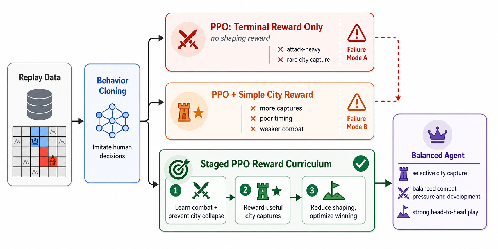
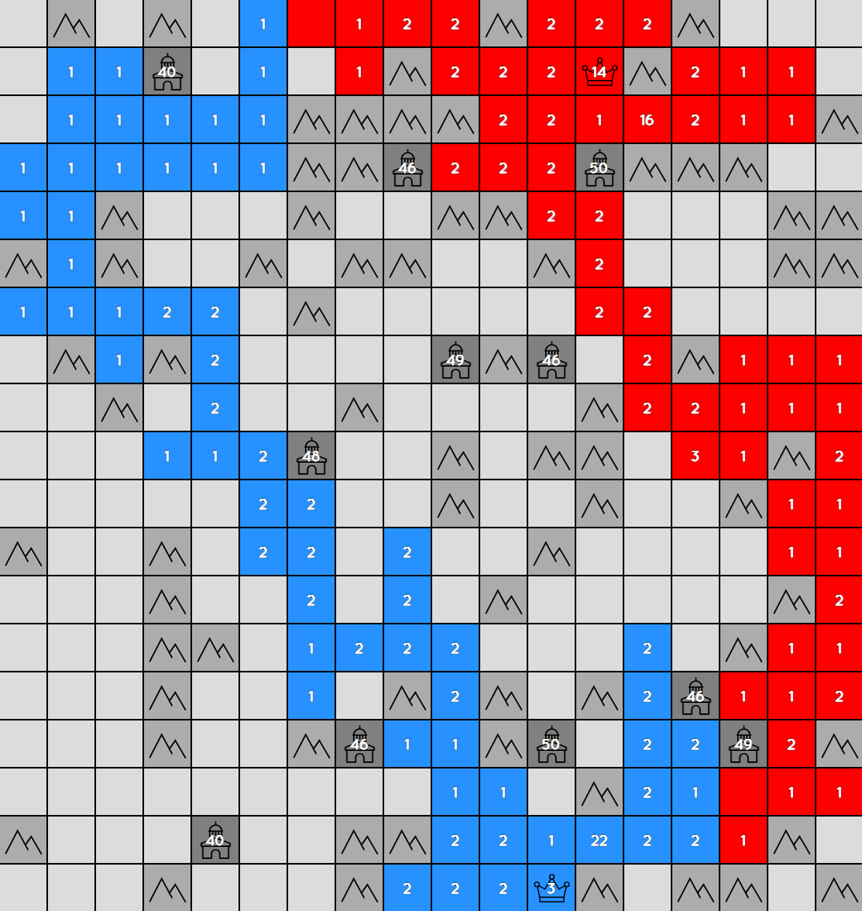
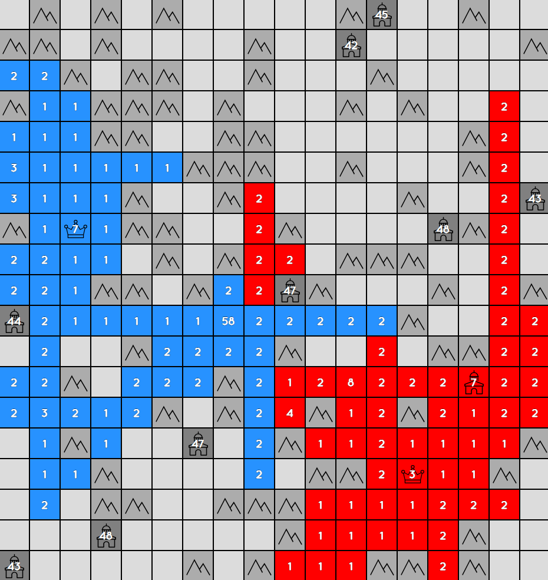
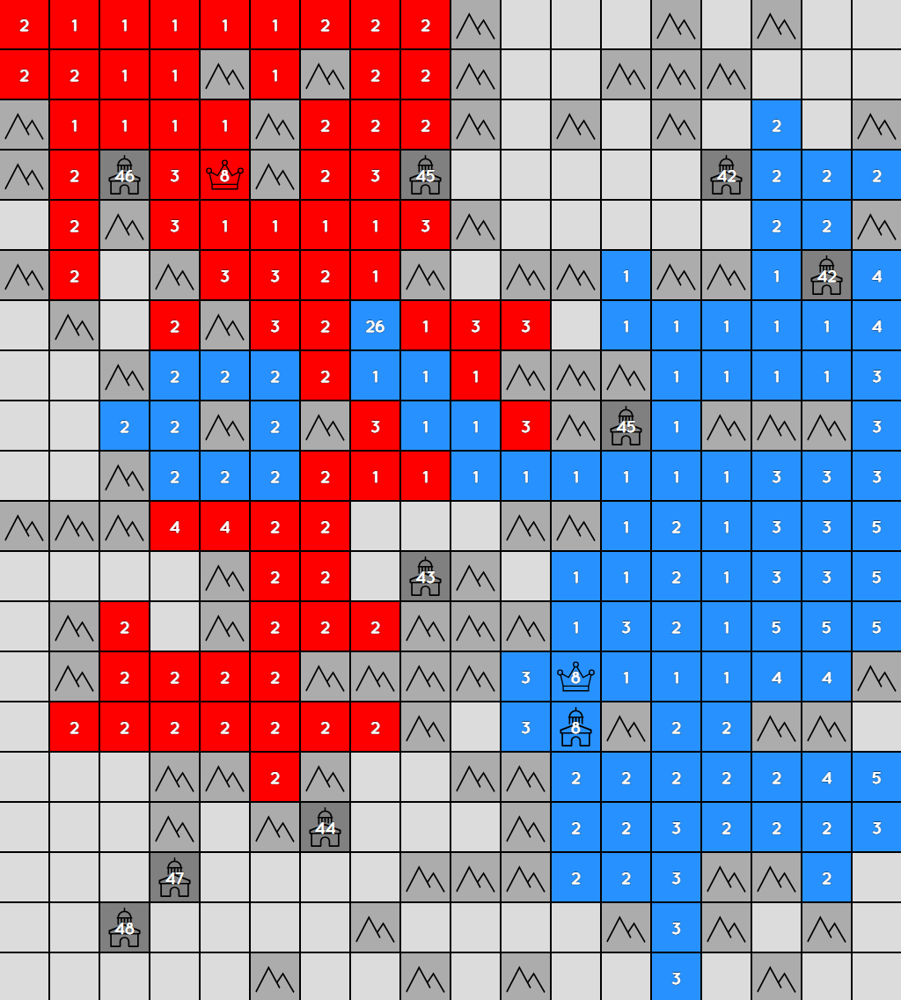

# Staged Reward Generals.io Bot

This repository contains a clean release of a Generals.io bot training project:
a local simulator, replay-based behavior cloning, PPO self-play, staged reward
shaping for delayed city-capture objectives, trained checkpoints, HTML replay
visualization, and a `bot.generals.io` private-room adapter.

The main research question is how to train an RTS-like agent to balance
short-term combat pressure with delayed strategic investments. Neutral city
capture is the measurable case study: capturing a city costs army immediately,
but can provide long-term production value many turns later.



## Highlights

- Implements a local two-player Generals.io-style simulator and match runner.
- Trains agents from public replay data with behavior cloning.
- Improves agents with PPO self-play and frozen opponent pools.
- Uses staged reward shaping to teach selective neutral-city capture.
- Includes six report-facing checkpoints, including the final staged agent.
- Provides local HTML replay rendering with global and per-player POV boards.
- Provides a `bot.generals.io` adapter for private-room online play.

The compact course-project report is included at
[`docs/report.pdf`](docs/report.pdf).

## Key Results

The final method is `Step 1+2+3`, a staged city-aware PPO agent initialized from
behavior cloning. Local simulator numbers are intended for reproducible
comparisons; online private-room games are coarse external calibration rather
than official ladder evidence.

| Comparison | Result | Notes |
| --- | ---: | --- |
| Final vs terminal-only PPO | 0.594 decided win rate | local fixed 18x18, 404-276-20 |
| High city reward vs terminal-only PPO | 0.414 decided win rate | naive city reward over-optimizes |
| Final neutral-city attack success | 0.633 | higher than high-city baseline |
| Final vs Human.exe | 16-24, 0.400 win rate | online private-room calibration |
| Terminal PPO vs Human.exe | 3-15, 0.167 win rate | online private-room calibration |

The online Human.exe result suggests roughly top-100-level practical private-room
strength, but it is not an official leaderboard rank.

## Example Visuals

The replay renderer can show the full board, each player's point of view, army
and land counts, value estimates when available, and auto-play controls.



Neutral city capture is useful only when the timing is right:

| Risky capture | Better-timed capture |
| --- | --- |
|  |  |

## Installation

```bash
python3 -m venv .venv
.venv/bin/python -m pip install -r requirements.txt
```

All commands below should be run from this directory.
Use `.venv/bin/python`, not the system `python`, when running the examples.
If online play fails with `ModuleNotFoundError: numpy`, `socketio`, or `torch`,
the dependencies were not installed in the interpreter used to launch the bot.

## Included Checkpoints

The checkpoint directory names match the method names used in the report:

| Directory | Method |
| --- | --- |
| `checkpoints/bc/model.pt` | Behavior cloning |
| `checkpoints/terminal_ppo/model.pt` | BC + terminal-reward PPO |
| `checkpoints/high_city/model.pt` | BC + PPO with high city reward |
| `checkpoints/step1/model.pt` | BC + PPO stage 1 |
| `checkpoints/step1_step2/model.pt` | BC + PPO stages 1 and 2 |
| `checkpoints/step1_step2_step3/model.pt` | Final staged city-aware agent |

Recommended model:

```text
checkpoint:checkpoints/step1_step2_step3/model.pt
```

The included checkpoints are about 204 MB total. For a lightweight Git history,
upload checkpoints as GitHub Release assets or use Git LFS. For a self-contained
course-project repository, keeping the included checkpoints in the repository is
also workable because each checkpoint is below GitHub's hard file-size limit.

## Render One Local Replay

```bash
PYTHONPATH=src .venv/bin/python scripts/render_match.py \
  --agent0 checkpoint:checkpoints/step1_step2_step3/model.pt \
  --agent1 checkpoint:checkpoints/terminal_ppo/model.pt \
  --turns 800 \
  --map generated \
  --min-size 18 \
  --max-size 18 \
  --seed 0 \
  --device cpu \
  --output artifacts/demo_final_vs_terminal.html \
  --report artifacts/demo_final_vs_terminal.json
```

Open `artifacts/demo_final_vs_terminal.html` in a browser.

## Run a Small Head-to-Head Evaluation

```bash
PYTHONPATH=src .venv/bin/python scripts/evaluate_match.py \
  --agent final=checkpoint:checkpoints/step1_step2_step3/model.pt \
  --agent terminal=checkpoint:checkpoints/terminal_ppo/model.pt \
  --pair final:terminal \
  --turns 800 \
  --seed-start 0 \
  --seed-count 20 \
  --map generated \
  --min-size 18 \
  --max-size 18 \
  --batched \
  --device cpu \
  --output-dir artifacts/eval_final_vs_terminal
```

The aggregate result is written to
`artifacts/eval_final_vs_terminal/summary.json`.

## Measure City-Capture Behavior

```bash
PYTHONPATH=src .venv/bin/python scripts/evaluate_city_behavior.py \
  --agent final=checkpoint:checkpoints/step1_step2_step3/model.pt \
  --mode selfplay \
  --target-turn 1200 \
  --seed-start 0 \
  --seed-count 20 \
  --map generated \
  --min-size 18 \
  --max-size 18 \
  --device cpu \
  --output-dir artifacts/city_behavior_final

PYTHONPATH=src .venv/bin/python scripts/summarize_city_capture_outcome.py \
  --input artifacts/city_behavior_final/records.jsonl \
  --output artifacts/city_behavior_final/city_capture_outcome.json
```

## Online Play on bot.generals.io

Create a private bot id on `bot.generals.io`, then copy `.env.example`:

```bash
cp .env.example .env
```

Edit `.env`:

```text
GENERALS_AGENT=checkpoint:checkpoints/step1_step2_step3/model.pt
GENERALS_USER_ID=YOUR_PRIVATE_USER_ID
GENERALS_USERNAME="[Bot] your_bot_name"
GENERALS_ROOM_ID=your_private_room
GENERALS_MODE=private
GENERALS_DEVICE=cpu
```

Then run:

```bash
PYTHONPATH=src .venv/bin/python scripts/run_remote_agent.py
```

`GENERALS_USER_ID` is the private bot id bound on `bot.generals.io`. It is not
the display name. Never commit `.env`.

You can also pass settings directly:

```bash
PYTHONPATH=src .venv/bin/python scripts/run_remote_agent.py \
  --agent checkpoint:checkpoints/step1_step2_step3/model.pt \
  --user-id YOUR_PRIVATE_USER_ID \
  --username "[Bot] your_bot_name" \
  --room-id your_private_room \
  --mode private \
  --device cpu
```

## Tests

Install `requirements.txt` before running the full suite; training and remote
adapter tests import `torch` and `python-socketio`.

```bash
PYTHONPATH=src .venv/bin/python -m unittest discover -s tests
```

The release test suite covers the simulator, local match runner, visualization
recorder, remote state translation, and training utilities. It excludes private
online batch-evaluation tests.

## Training Note

The included scripts `train_bc.py` and `train_ppo.py` are kept for
reproducibility, but the full replay dataset is not included. Training from
scratch requires preparing replay shards under `data/`, while running and
evaluating the included checkpoints does not.

## Repository Layout

```text
src/generals_bot/          simulator, agents, match runner, training code
scripts/                   training, evaluation, visualization, online adapter
configs/                   reward and opponent-pool configs
checkpoints/               report-facing model checkpoints
docs/                      model card, online-play guide, simulator docs
tests/                     unit tests and smoke tests
```

## What Is Excluded

Large replay datasets, TensorBoard runs, temporary artifacts, private bot ids,
raw experiment logs, and remote-machine configuration are intentionally excluded.

## Third-Party Notice

This repository contains a Python port of the public Flobot benchmark bot and
uses public Generals.io replay data for behavior-cloning experiments. See
`THIRD_PARTY_NOTICES.md` for details.

## License

This release is licensed under the Apache License 2.0. See `LICENSE` and
`NOTICE`.
